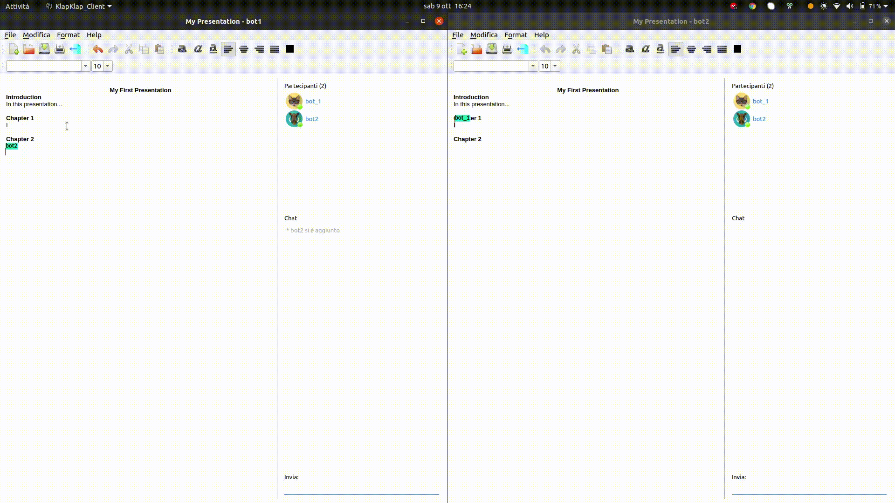
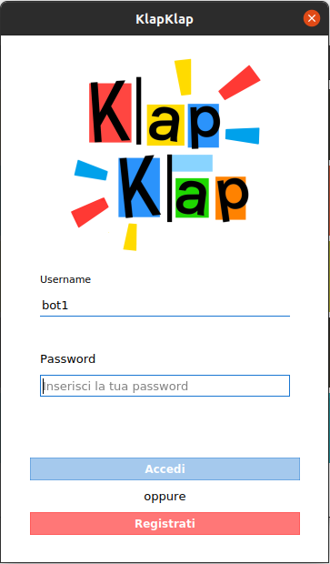
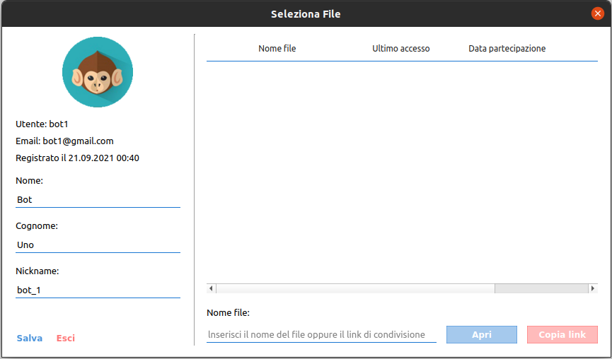
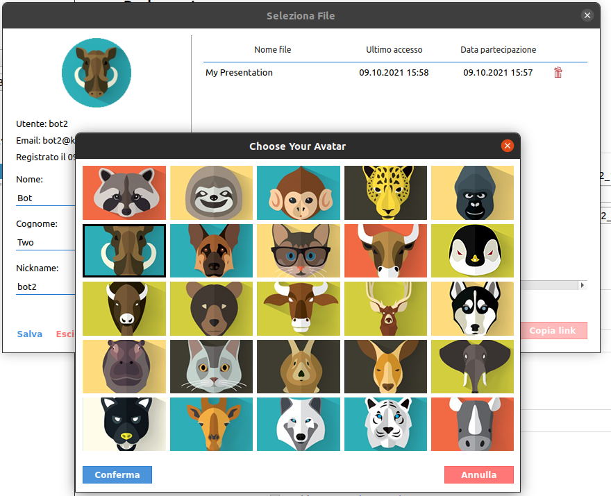
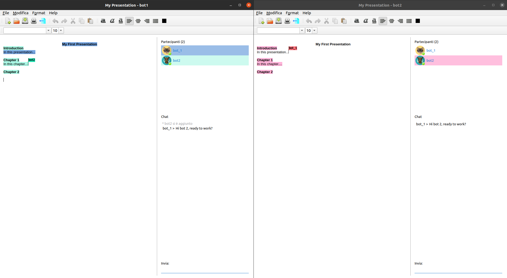

# Course Project
The availability of broadband connections and the need to work in a team without necessarily require the co-presence of the actors in the same physical space, pushes towards the creation of increasingly effective support systems for cooperative work. Eg, Google provides the Docs suite, through which it is possible to edit, so cooperative and distributed, documents of various kinds (texts, spreadsheets, presentations) and in able to scale even large numbers of contemporary users: this solution is based on a set of centralized servers that manage traffic to and from individual clients and put the logic necessary to guarantee the correctness of the concurrent operations is in place.

Use the C ++ language to create a cooperative textual editing system that allows one or more users to modify the content of a document at the same time, ensuring that different insertion or modification operations, carried out by users to the same time, produce the same effects, regardless of the order in which they are performed on different systems in use (commutativity) and that repeated deletions lead to the same result
(idempotence).

# Requirements
1. Architecture. The system consists of two independent modules, the client and the server.
2. The server consists of a constantly active process, capable of accepting, through the network, connections from clients. The server, on the inside, keeps
a set of documents that can be edited collaboratively by clients. These documents are stored on the server's file system, so as not to lose their
content in case of accidental interruption of the process. Rescue operations they are performed automatically and do not require any explicit request from the part of clients.
3. Clients are discontinuous processes (they can be started and ended in a independent, according to the will of the user), performed within computers
networked with the server. The clients offer a graphical interface through which a user can ask the server to edit one of the active documents or ask to
create a new one, assign it a unique name. When the required document comes open, the client offers a typical editor interface that allows you to edit the
document. If two or more clients edit the document at the same time, the server ensures that the operations performed generate, in each client, a consistent representation. Individual clients show the number and identity of users that are editing the current document and highlight the cursor position of the different users within the document. The client can highlight the entered text by different users using different colors.
4. Identity management. When starting a client, the user must identify himself with the server using appropriate credentials (username, password). For each user, the server maintains a profile (nickname, icon, ...) that can be changed by the user through your client.

# Extensions
## Publishing a document
The client can produce a PDF version of the current document and save it in its own file system.

## Text enrichment
The editor can allow you to add style attributes (bold, italic, underline, font and size, alignment, ...). These attributes are shared among all clients and
they are part of the document itself.

## Actions enrichment
The editor allows you to copy and paste textual content inside the computer of the client. Text editing operations can be activated via shortcuts from keyboard (e.g. Ctrl-C / Ctrl-V) or from appropriate graphic menus.

## Invitation to collaborate
A client can send to his acquaintances, through the channel he deems appropriate (e-mail, chat, ...), a URI referring to the current document. By copying and pasting that URI into your own client, the recipient of the invitation can access the document and participate in its modification.

# Folders
- **src** folder contains the source code. The code within it can be organized as you wish according to the conventions of the language. The important thing is that it only contains the program/library code.
- **test** folder contains the source code dedicated to tests. The test code is used to test the correct functioning of the developed classes or some software modules or they can simply be performance tests.
- build folder contains all files obtained as leftovers from a build. They can be partial C / C ++ modules (.o). The folder is in turn divided into the various compilation configurations (for example, there could be a Debug configuration with compiled optimized for debug and a Release configuration with compiled optimized for performance).
- **dist** folder contains the finished product. It can be the executable program. Everything in dist must be ready to run and deploy.
- **doc** folder contains detailed documentation.

# Results

## Client

### Login

### Home

### Avatars

### Editing

